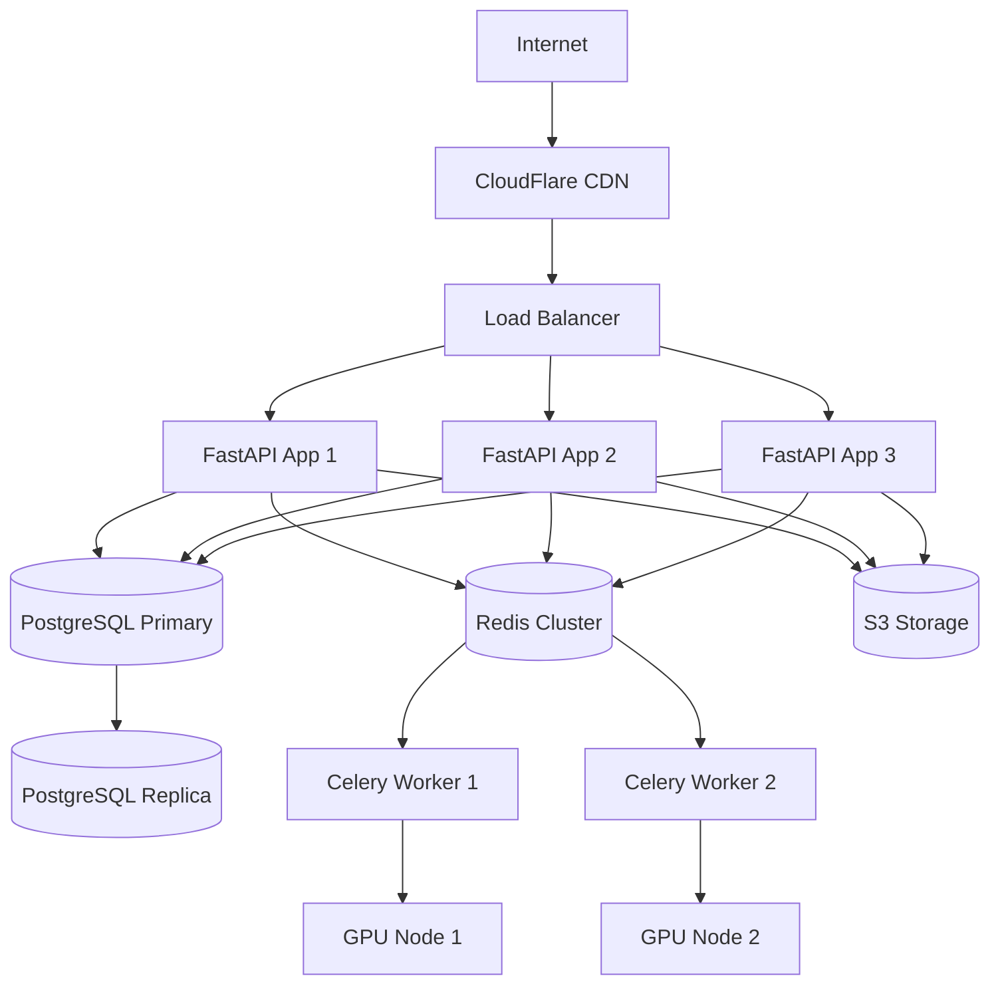

# Architecture documentation
# codebegen System Architecture

**Document Version:** 1.0  
**Last Updated:** 2025-08-15 00:37:03 UTC  
**Author:** SamuelOshin  
**Status:** Living Document

---

## 📋 Table of Contents

1. [System Overview](#system-overview)
2. [High-Level Architecture](#high-level-architecture)
3. [AI Pipeline Architecture](#ai-pipeline-architecture)
4. [Data Flow](#data-flow)
5. [Component Architecture](#component-architecture)
6. [Database Design](#database-design)
7. [Security Architecture](#security-architecture)
8. [Deployment Architecture](#deployment-architecture)
9. [Scalability Considerations](#scalability-considerations)
10. [Technology Stack](#technology-stack)
11. [API Design](#api-design)
12. [Decision Records](#decision-records)

---

## System Overview

**codebegen** is an AI-powered platform that transforms natural language descriptions into production-ready FastAPI backend projects. The system employs a multi-model AI pipeline to handle schema extraction, code generation, quality review, and documentation generation.

### Core Objectives
- **Speed**: Generate complete FastAPI projects in under 5 minutes
- **Quality**: Production-ready code with tests, documentation, and deployment configs
- **Flexibility**: Support multiple tech stacks and iterative refinement
- **Scalability**: Handle concurrent users and large-scale AI inference
- **Reliability**: 99.9% uptime with robust error handling and recovery

---

## High-Level Architecture


---

## AI Pipeline Architecture

### Multi-Model Pipeline Design

The AI pipeline consists of four specialized models working in sequence:


### Model Specifications

| Model | Purpose | Size | Context Window | Fine-tuned |
|-------|---------|------|----------------|------------|
| **Qwen2.5-Coder-32B** | Primary code generation | 32B params | 32K tokens | ✅ LoRA |
| **Llama-3.1-8B** | Schema extraction | 8B params | 128K tokens | ❌ |
| **Starcoder2-15B** | Code review & security | 15B params | 16K tokens | ❌ |
| **Mistral-7B-Instruct** | Documentation generation | 7B params | 32K tokens | ❌ |

### Model Loading Strategy

```python
# Singleton pattern for model management
class ModelManager:
    def __init__(self):
        self.models = {}
        self.model_locks = {}
        self.device_allocator = GPUAllocator()
    
    async def load_model(self, model_type: str) -> BaseModel:
        if model_type not in self.models:
            device = await self.device_allocator.allocate(model_type)
            self.models[model_type] = await self._load_model_async(model_type, device)
        return self.models[model_type]
```

---

## Data Flow

### Generation Request Flow

1. **User Input**: Natural language prompt via web UI or API
2. **Authentication**: JWT token validation and rate limiting
3. **Project Creation**: Store generation request in database
4. **Queue Processing**: Add generation job to Celery queue
5. **AI Pipeline**: Execute 4-stage AI pipeline
6. **Quality Gates**: Validate code syntax, run tests, security scan
7. **Storage**: Save files to S3/MinIO, create downloadable ZIP
8. **Delivery**: Provide download link or create GitHub PR
9. **Feedback**: Track user satisfaction and quality metrics

### Streaming Progress Updates


---

## Component Architecture

### Clean Architecture Layers

```
┌─────────────────────────────────────┐
│          Presentation Layer         │
│        (FastAPI Routers)           │
├─────────────────────────────────────┤
│         Application Layer           │
│    (Services & Orchestrators)      │
├─────────────────────────────────────┤
│           Domain Layer              │
│     (Models & Business Logic)      │
├─────────────────────────────────────┤
│        Infrastructure Layer        │
│  (Repositories, External APIs)     │
└─────────────────────────────────────┘
```

### Service Dependencies


---

## Database Design

### Core Entities


### Indexing Strategy

```sql
-- Performance indexes
CREATE INDEX idx_projects_user_id ON projects(user_id);
CREATE INDEX idx_projects_status ON projects(status);
CREATE INDEX idx_generations_project_id ON generations(project_id);
CREATE INDEX idx_generations_status ON generations(status);
CREATE INDEX idx_generations_created_at ON generations(created_at);

-- Search indexes
CREATE INDEX idx_projects_name_gin ON projects USING gin(to_tsvector('english', name));
CREATE INDEX idx_projects_domain ON projects(domain);
```

---

## Security Architecture

### Authentication & Authorization


### Security Measures

1. **Input Validation**
   - Pydantic schema validation for all inputs
   - SQL injection prevention via SQLAlchemy ORM
   - XSS protection with content sanitization

2. **Authentication**
   - JWT tokens with short expiration (30 minutes)
   - Refresh token rotation
   - GitHub OAuth integration

3. **Rate Limiting**
   - Per-user rate limits via Redis
   - Generation quotas based on subscription tier
   - IP-based rate limiting for unauthenticated requests

4. **Code Generation Security**
   - Sandboxed code execution for validation
   - Static analysis of generated code
   - No secrets or credentials in generated output

5. **Infrastructure Security**
   - HTTPS only in production
   - Environment variable management
   - Container security scanning
   - Regular dependency updates

---

## Deployment Architecture

### Production Environment



### Container Strategy

```dockerfile
# Multi-stage build for optimized images
FROM python:3.11-slim as base
# Base dependencies

FROM base as ai-models
# Download and cache AI models

FROM base as app
# Application code
COPY --from=ai-models /models /app/models
```

### Kubernetes Deployment

```yaml
apiVersion: apps/v1
kind: Deployment
metadata:
  name: codebegen-api
spec:
  replicas: 3
  selector:
    matchLabels:
      app: codebegen-api
  template:
    spec:
      containers:
      - name: api
        image: codebegen/api:latest
        resources:
          requests:
            memory: "2Gi"
            cpu: "1000m"
          limits:
            memory: "4Gi"
            cpu: "2000m"
---
apiVersion: apps/v1
kind: Deployment
metadata:
  name: codebegen-workers
spec:
  replicas: 2
  template:
    spec:
      containers:
      - name: worker
        image: codebegen/worker:latest
        resources:
          requests:
            memory: "8Gi"
            cpu: "4000m"
            nvidia.com/gpu: 1
          limits:
            memory: "16Gi"
            cpu: "8000m"
            nvidia.com/gpu: 1
```

---

## Scalability Considerations

### Horizontal Scaling

1. **API Layer**
   - Stateless FastAPI instances
   - Load balancing with health checks
   - Auto-scaling based on CPU/memory usage

2. **AI Processing**
   - GPU-optimized worker nodes
   - Model sharding across multiple GPUs
   - Queue-based processing with Celery

3. **Database**
   - Read replicas for analytics queries
   - Connection pooling with PgBouncer
   - Partitioning for large tables (generations, artifacts)

4. **Caching Strategy**
   - Redis cluster for session storage
   - Application-level caching for frequent queries
   - CDN caching for static assets

### Performance Optimization

1. **Model Inference**
   - vLLM for optimized inference
   - Model quantization (int8/int4)
   - Batch processing for multiple requests

2. **Database**
   - Query optimization with EXPLAIN ANALYZE
   - Index optimization for common queries
   - Database connection pooling

3. **File Storage**
   - S3 with CloudFront CDN
   - Parallel uploads for large files
   - Compression for generated code archives

---

## Technology Stack

### Backend Core
- **Framework**: FastAPI 0.104+
- **Language**: Python 3.11+
- **ORM**: SQLAlchemy 2.0
- **Validation**: Pydantic v2
- **Database**: PostgreSQL 15+
- **Cache**: Redis 7+
- **Queue**: Celery with Redis broker

### AI/ML Stack
- **Models**: Transformers, vLLM, Ollama
- **Fine-tuning**: LoRA with PEFT
- **Inference**: torch, accelerate
- **Monitoring**: Weights & Biases

### Infrastructure
- **Containerization**: Docker, Docker Compose
- **Orchestration**: Kubernetes
- **Storage**: AWS S3 / MinIO
- **Monitoring**: Prometheus, Grafana
- **Logging**: Structured logging with loguru

### Development Tools
- **Code Quality**: Black, isort, Ruff, mypy
- **Testing**: pytest, pytest-asyncio
- **Documentation**: MkDocs, OpenAPI
- **CI/CD**: GitHub Actions

---

## API Design

### RESTful Principles

- **Resource-based URLs**: `/projects/{id}`, `/generations/{id}`
- **HTTP methods**: GET, POST, PUT, DELETE with appropriate semantics
- **Status codes**: Proper HTTP status codes for different scenarios
- **Content negotiation**: JSON by default, support for other formats

### API Versioning

- **URL versioning**: `/api/v1/` prefix for all endpoints
- **Backward compatibility**: Maintain support for previous versions
- **Deprecation strategy**: Clear timeline for version sunset

### Rate Limiting

```python
# Per-user rate limits
@app.middleware("http")
async def rate_limit_middleware(request: Request, call_next):
    user_id = get_user_id_from_request(request)
    
    # Different limits for different tiers
    limits = {
        "free": "5/hour",
        "pro": "100/hour", 
        "enterprise": "1000/hour"
    }
```

---

## Decision Records

### ADR-001: Multi-Model AI Pipeline
**Date**: 2025-08-15  
**Status**: Accepted  
**Decision**: Use specialized models for different tasks instead of one large model  
**Rationale**: Better performance, cost efficiency, easier fine-tuning  
**Consequences**: Increased complexity, more resource management  

### ADR-002: LoRA Fine-tuning for Code Generation
**Date**: 2025-08-15  
**Status**: Accepted  
**Decision**: Use LoRA adaptation instead of full fine-tuning  
**Rationale**: Much faster training, lower resource requirements, preserves base model knowledge  
**Consequences**: Slightly reduced customization compared to full fine-tuning  

### ADR-003: FastAPI for Backend Framework
**Date**: 2025-08-15  
**Status**: Accepted  
**Decision**: Use FastAPI instead of Django or Flask  
**Rationale**: Async support, automatic API docs, type hints, performance  
**Consequences**: Smaller ecosystem compared to Django  

### ADR-004: PostgreSQL for Primary Database
**Date**: 2025-08-15  
**Status**: Accepted  
**Decision**: Use PostgreSQL instead of MongoDB or MySQL  
**Rationale**: ACID compliance, JSON support, excellent performance, mature ecosystem  
**Consequences**: More complex for document-style data  

### ADR-005: Celery for Background Processing
**Date**: 2025-08-15  
**Status**: Accepted  
**Decision**: Use Celery with Redis for AI processing tasks  
**Rationale**: Mature, scalable, good monitoring tools  
**Consequences**: Additional infrastructure complexity  

---

## Future Considerations

### Planned Enhancements
- **Multi-tenancy**: Organization-level isolation
- **A/B Testing**: Model performance comparison
- **Custom Templates**: User-defined code templates
- **API SDKs**: Generated client libraries
- **Enterprise Features**: SSO, audit logs, compliance

### Technical Debt
- **Model Caching**: Implement intelligent model loading/unloading
- **Observability**: Add distributed tracing
- **Testing**: Increase test coverage to 90%+
- **Documentation**: Auto-generate API documentation

---

**Document Maintainers**: SamuelOshin  
**Review Schedule**: Monthly  
**Next Review**: 2025-09-15
